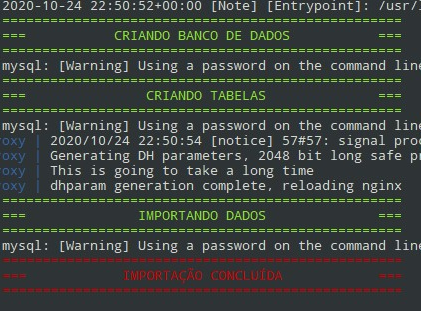

### Executando o Fullstack Challenge
##
A instalação é feita com o Docker (docker-compose). Os serviços incluídos são:
- Proxy nginx para acesso do admin, backend e shop
- Mysql para banco de dados do backend
- Memcache e redis para cache do admin, backend e shop
- Nginx-PHP para o admin (acessível pelo proxy nginx)
- Nginx-PHP para o backend (acessível pelo proxy nginx)
- Nginx-PHP para o shop (acessível pelo proxy nginx)
- Composer para instalação dos pacotes necessários
##
Antes de executar a instalação, confira as configurações no arquivo `.env` na raiz do repositório. Nele contém a porta de acesso padrão `8988` e o hostname padrão da URL de acesso `w51.laravel`, mude se necessário e insira no seu arquivo de hosts os endereços:

```
XXX.XXX.XXX.XXX HOST_NAME
XXX.XXX.XXX.XXX backend.HOST_NAME
XXX.XXX.XXX.XXX shop.HOST_NAME
```

Por exemplo
```
192.168.2.3 w51.laravel
192.168.2.3 backend.w51.laravel
192.168.2.3 shop.w51.laravel
```

Esteja atento a variável `DOCKER_SOCKET` que é necessária para o serviço `nginx-proxy`, por padrão está o caminho do socket do docker `DOCKER_SOCKET=/var/run/docker.sock` no linux, mude para o caminho do seu setup caso necessário.

##
Para executar a instalação pela primeira vez rode o seguinte comando:

`docker-compose up composer mysql redis memcached nginx-proxy frontend backend shop`

Esteja atento para a mensagem de conclusão da criação/importação do banco de dados inicial:



Para executar novamente após a primeira execução rode o seguinte comando que irá iniciar todos os serviços necessários:

`docker-compose up nginx-proxy`
##
O acesso ao admin é feito pelo endereço por padrão `http://w51.laravel:8988/login`, confira caso tenha feito alguma alteração nas variáveis do arquivo `.env`.

Usuário `admin`

Senha: `admin`

O acesso ao shop é feito pelo endereço por padrão `http://shop.w51.laravel:8988/`, confira caso tenha feito alguma alteração nas variáveis do arquivo `.env`.

Qualquer dúvida ou problemas sinta-se livre para entrar em contato.
#

# Apresentação

Nós da W51.Agency agradecemos seu interesse em participar do nosso processo seletivo.
Queremos formar um time único com pessoas comprometidas, que gostem de gerar soluções e estamos em busca de talentos que possam fazer a diferença nos projetos e nas nossas vidas.

Esperamos que você seja parte deste projeto num futuro bem próximo! Boa Sorte!

# Termos e Condições

Ao iniciar este teste você aceita as condições de iniciar a construção do código sem nenhum vínculo conosco, apenas a critério de avaliação. As horas aplicadas por você não serão objeto de remuneração ou contrato freelancer ou  vínculo trabalhista.

Nenhuma parte do código desenvolvido será utilizado para fins comerciais.

Você assume a responsabilidade de não divulgar informações a terceiros sobre o conteúdo deste processo seletivo em qualquer canais de mídia, redes sociais, emails.

# Instruções sobre o teste

Nós da W51 estamos propondo a construção de uma página com o objetivo de vendas de produtos online.

Gostaríamos que dentro do escopo apresentado, por sua conta, você selecione qual ou quais as funcionalidades é capaz de desenvolver de forma completa dentro do prazo estipulado.

Tempo para Execução: `Máximo de 4 horas`

Material de Apoio: Arquivo `.psd` com o layout desktop e mobile na versão Windows ou MAC [baixar](https://drive.google.com/file/d/1VT-C9htCpR4wJU_zXLq-2wp8XRBCsMAX/view?usp=sharing).


#### Formato da Entrega:

- Ao final do teste você deverá publicar o site desenvolvido em algum repositório de sua preferência ( github, bitbucket, etc);
- Deverá escrever o arquivo README para orientar a instalação;
- Deverá nos encaminhar o link para acessar o código (permissão de leitura);
